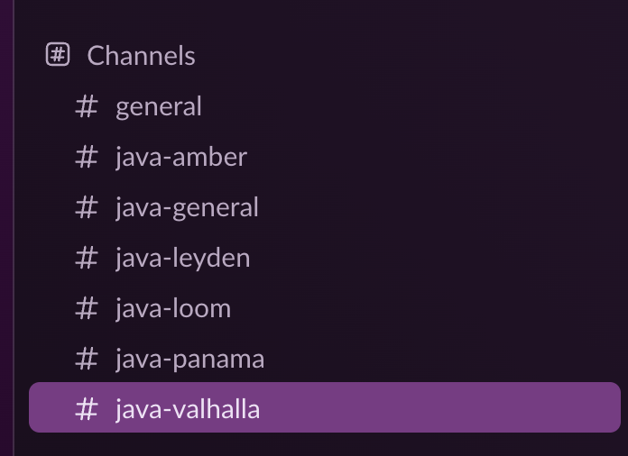
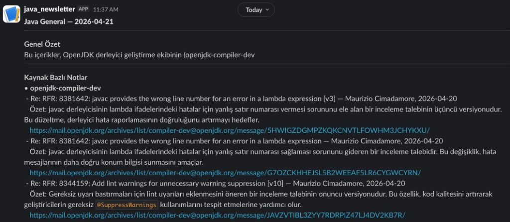
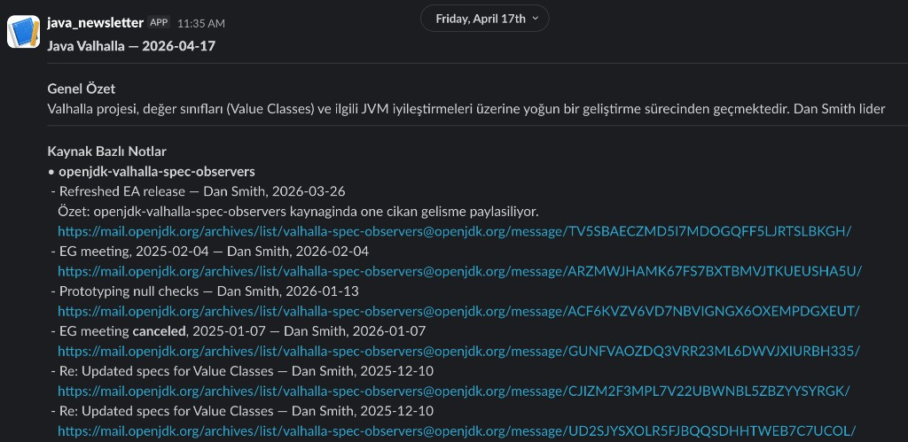

# Java Digest Bot

Java Digest Bot tracks key Java ecosystem sources (RSS feeds, OpenJDK mailing lists, and JEP changes), then publishes AI-assisted daily summaries to Slack channels.

The project supports:
- Channel-based Slack routing (`general`, `amber`, `valhalla`, `loom`, `leyden`, `panama`)
- Per-link short AI summaries
- Detailed long-form channel summaries for Amber and Valhalla
- Retry/fallback behavior for Gemini API rate/load issues

## What It Tracks

### Author-filtered RSS feeds

| Source | Method |
|---|---|
| [inside.java](https://inside.java) | RSS + tracked author filter |
| [InfoQ Java](https://www.infoq.com/java/) | RSS + tracked author filter |

### OpenJDK mailing lists

| List | Focus area |
|---|---|
| `amber-spec-experts` | Records, Pattern Matching, Sealed Classes |
| `valhalla-spec-observers` | Value Types, Null Safety |
| `loom-dev` | Virtual Threads, Structured Concurrency |
| `jdk-dev` | General JDK development |
| `panama-dev` | Foreign Function & Memory API |
| `leyden-dev` | Startup performance, AOT |
| `compiler-dev` | Compiler/HotSpot |
| `zgc-dev` | ZGC |

### Community feeds

| Source | Notes |
|---|---|
| [dev.java](https://dev.java) | Official Java developer portal |
| [Java Almanac](https://javaalmanac.io) | Java platform/version updates (GitHub Atom feed) |
| [Foojay](https://foojay.io) | Community updates and deep dives |
| [Baeldung](https://www.baeldung.com) | Tutorials and practical guides |
| [DZone Java](https://dzone.com/java) | Java ecosystem articles |
| [Spring Blog](https://spring.io/blog) | Spring updates |
| [Quarkus Blog](https://quarkus.io/blog) | Quarkus updates |
| [JetBrains IDEA Blog](https://blog.jetbrains.com/idea/) | Tooling updates |

### JEP status tracking

JEP changes are checked from [openjdk.org/jeps/0](https://openjdk.org/jeps/0) for:
`Amber`, `Valhalla`, `Loom`, `Panama`, `Leyden`, `Lilliput`.

## Slack Community and Channels

You can join the `java-newsletter` Slack community and subscribe only to channels you care about.  
After joining the workspace, simply join channels like:

- `#java-general`
- `#java-amber`
- `#java-valhalla`
- `#java-loom`
- `#java-leyden`
- `#java-panama`

Then you can just wait for scheduled updates in that channel.

### Example screenshots

Channel selection example:



General channel message example:



Valhalla channel message example:



## Setup

### 1) Clone the repository

```bash
git clone https://github.com/umiitkose/java-newsletter
cd java-newsletter
```

### 2) Configure sources and filters

All source/filter settings are centralized in `config.yml`:

```yaml
authors:
keywords:
rss:
mailingLists:
jep:
ai:
pages:
```

Current default AI config in the repository:

```yaml
ai:
  enabled: true
  provider: gemini
```

### 3) Configure Slack webhooks

Create one incoming webhook per target channel in Slack.

Required minimum:
- `SLACK_WEBHOOK_GENERAL`

Optional project channels:
- `SLACK_WEBHOOK_AMBER`
- `SLACK_WEBHOOK_VALHALLA`
- `SLACK_WEBHOOK_LOOM`
- `SLACK_WEBHOOK_LEYDEN`
- `SLACK_WEBHOOK_PANAMA`

### 4) Configure GitHub Actions secrets / variables

Go to:
`Repository -> Settings -> Secrets and variables -> Actions`

Recommended secrets:

| Name | Required | Description |
|---|---|---|
| `SLACK_WEBHOOK_GENERAL` | Yes | General channel webhook |
| `SLACK_WEBHOOK_AMBER` | No | Amber channel webhook |
| `SLACK_WEBHOOK_VALHALLA` | No | Valhalla channel webhook |
| `SLACK_WEBHOOK_LOOM` | No | Loom channel webhook |
| `SLACK_WEBHOOK_LEYDEN` | No | Leyden channel webhook |
| `SLACK_WEBHOOK_PANAMA` | No | Panama channel webhook |
| `GEMINI_API_KEY` | No* | Gemini provider key |
| `OPENAI_API_KEY` | No* | OpenAI provider key |

\*Required only for the provider you use.

Optional variables:

| Name | Description |
|---|---|
| `GEMINI_MODEL` | Primary Gemini model (default: `gemini-2.5-flash`) |
| `GEMINI_FALLBACK_MODEL` | Fallback model on retries (default: `gemini-2.5-flash-lite`) |
| `SUMMARY_MAX_ARTICLES` | Max article count used for AI summarization (default: `12`) |
| `PROJECT_DETAIL_MAX_ARTICLES` | Max article count for detailed Amber/Valhalla summaries (default: `20`) |

### 5) Run workflow manually

Use GitHub Actions `Run workflow` on `Java Digest — Günlük Özet`.

`mode=test` automatically enables `FORCE_SUMMARY=true`, which sends a test summary even when there are no unseen items, and skips `state.json` / `docs` persistence.

## Runtime Schedule

Defined in `.github/workflows/daily-digest.yml`:

- Daily digest: `0 8 * * *` (08:00 UTC)
- Weekly digest: `0 9 * * 1` (Monday 09:00 UTC)

## Local Run

```bash
# Build
mvn -q package -DskipTests

# Basic run
java -jar target/java-digest-1.0-SNAPSHOT.jar

# Gemini run
export GEMINI_API_KEY="..."
export GEMINI_MODEL="gemini-2.5-flash"          # optional
export GEMINI_FALLBACK_MODEL="gemini-2.5-flash-lite"  # optional
export SUMMARY_MAX_ARTICLES="12"                # optional
export PROJECT_DETAIL_MAX_ARTICLES="20"         # optional
export FORCE_SUMMARY="true"                     # optional test mode
java -jar target/java-digest-1.0-SNAPSHOT.jar
```

## Current Summary Behavior

- AI summaries prioritize: `amber`, `valhalla`, `loom`, `panama`, `leyden`, `openjdk-jep`
- Per-link short summaries are generated and shown under each link when possible
- Amber and Valhalla channels receive long-form detailed channel summaries
- Gemini calls include retry and model fallback strategy for `429/503`
- If AI output format is malformed, parsing falls back to regex and then safe per-item fallback text

## Architecture

```text
GitHub Actions (cron + manual)
  -> Main
     -> parallel fetchers (RSS, mailing lists, JEP)
     -> StateManager filter
     -> AISummarizer (general + per-link + detailed project summaries)
     -> SlackNotifier (channel routing + payload formatting)
     -> DigestPageGenerator (docs/, optional)
     -> state update
```

## Support

If this project helps you, please consider giving it a star on GitHub.

- Repository: [umiitkose/java-newsletter](https://github.com/umiitkose/java-newsletter)
- You can also share feedback in the `java-newsletter` Slack workspace or open an issue.

## License

MIT
